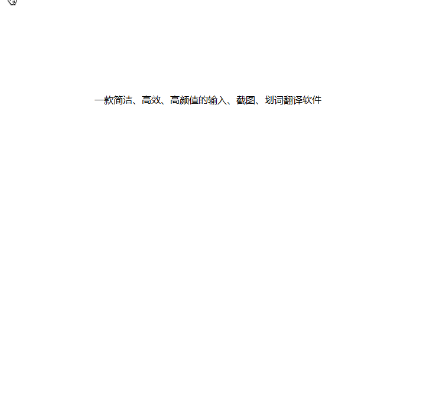
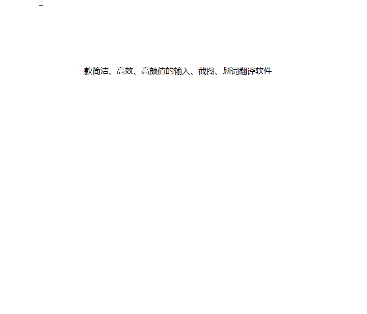
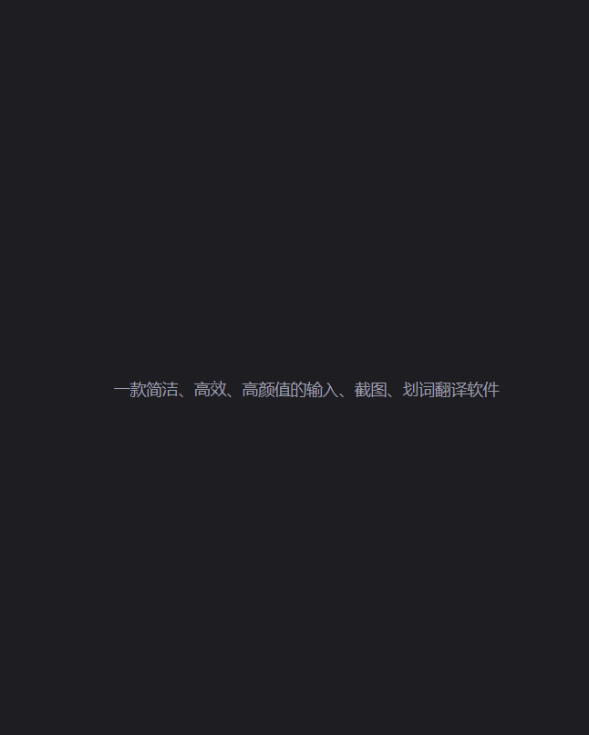

# TTime

🚀 A concise, efficient, good-looking input, screenshot, and word translation software

For more functions, see the official website.：[TTime Official website](https://ttime.timerecord.cn/)

## brief introduction

The main functions are `input translation`, `screenshot translation`, `selected translation`

It is inevitable that there are scenes that need to be translated in daily work or study, but there is no good looking, easy to use and simple translation tool

For this reason, `TTime` appears, which can help us improve our work and learning efficiency

## Support platform

| Linux | macOS | Windows |
| :---: | :---: | :-----: |
|   ❌   |   ✔️   |    ✔️    |

Linux is theoretically supported, but due to limited energy and lack of time for testing, it will not be released temporarily, and later versions may be released synchronously

## Example of use

### Input translation（Default shortcut key：Alt + Q）

### Screenshot translation（Default shortcut key：Alt + W）

### Selected translation （Default shortcut key：Alt + E）

## Translation interface

**Introduction to interface functions**

## Theme mode

### Dark mode

