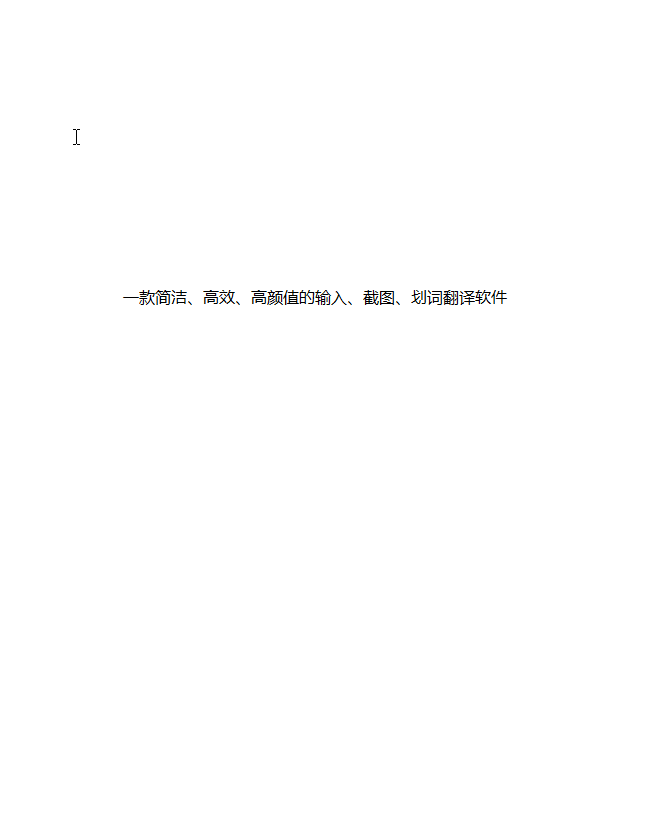

# TTime

🚀 一款简洁、高效、高颜值的输入、截图、划词翻译软件

## 简介

主要功能为`输入翻译`、`截图翻译`、`划词翻译`

平时工作或学习中难免会有存在需要翻译的场景，但是又没有一款好看好用而又简单的翻译工具

为此`TTime`出现了，它可以帮助我们平时更好的提高工作和学习效率

## 支持平台

| Linux | macOS | Windows |
| :---: | :---: | :-----: |
|   ❌   |   ✔️   |    ✔️    |

Linux理论上支持，但由于暂时精力有限，没时间测试，所以暂不发布，之后的版本可能会同步发布

## 使用示例

### 输入翻译 （默认快捷键：Alt + Q）

### 截图翻译 （默认快捷键：Alt + W）

### 划词翻译 （默认快捷键：Alt + E）

